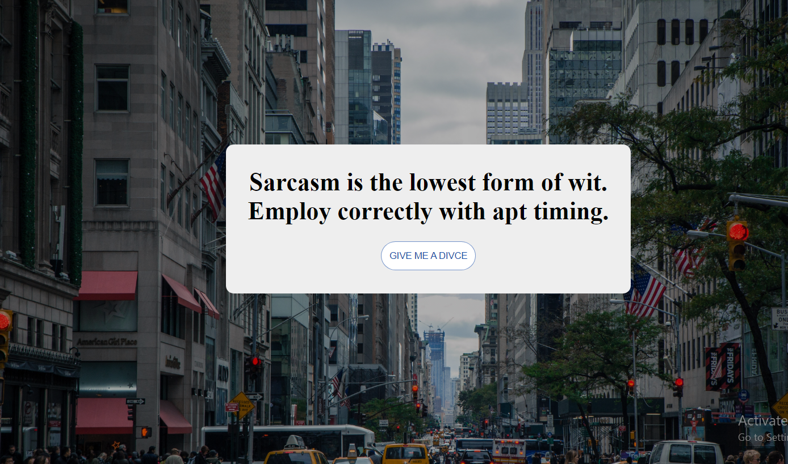

# Advice App

This is a single web application app built with react.js and use react hooks that use a random a dvice after fetching data from Rest API. 

## Table of contents

- [Overview](#overview)
  - [Screenshot](#screenshot)
  - [The challenge](#the-challenge)
  - [Live Site](#live-site)
- [My process](#my-process)
  - [Built with](#built-with)
  - [What I learned](#what-i-learned)
- [Author](#author)
- [Acknowledgments](#acknowledgments)


## Overview

### Screenshot
<a href="https://65706c2b13c031758264365d--curious-granita-0591b8.netlify.app/"> 
  
</a>


### The challenge

Users should be able to:

- View the optimal layout for the app depending on their device's screen size
- See the animation happen on the advice button after hover on it.
- Make a FetchData function to fetch data from Rest API.
- Triger advice after onClick advice button.


### Live Site

- Live Site URL: [https://65706c2b13c031758264365d--curious-granita-0591b8.netlify.app/]
## My process

### Built with

- React.js
- React Hooks {useState(), useEfect()}
- Rest API (Advice Slip JSON API)
- CSS custom properties
- Flexbox
- CSS Grid
- Mobile-first workflow


### What I learned

L learned from this app how i fetch data from Reast API to rondam advice by using reack hooks specific useState and useEfect.


Some of code snippets, see below:

```js
const fetchData = async () => {
        const repose = await fetch('https://api.adviceslip.com/advice');
        const jsonData = await repose.json();
        setAdvice(jsonData.slip.advice);
        console.log(advice);
    }

    useEffect(() => {
      fetchData();
    }, [])

```


## Author

- Website - [Ahmed Rafat]( https://ahmed-abo-rafat.github.io/Portfolio/)
- Linked In - [Ahmed Rafat](https://www.linkedin.com/in/ahmed-rafat-a489301a2/)
- Twitter - [Ahmed Rafat](https://twitter.com/AR57355660)


